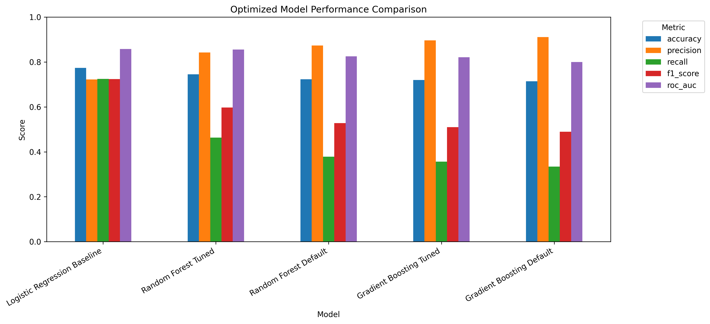

# Hotel Booking Cancellation Prediction

A data analytics capstone exploring hotel cancellation risk with Python, machine learning, and Power BI.

**Said Huner | Data and Machine Learning Lead | Humber Polytechnic, BIA 5450**

[Data preparation](notebooks/01-data-preparation.ipynb) · [Modeling](notebooks/02-cancellation-modeling.ipynb) · [Final report](reports/final-report.pdf) · [Presentation](presentations/final-presentation.pdf) · [Power BI](dashboards/hotel-cancellation.pbix)

> **Version note:** The included modeling notebook and saved CSV metrics represent the earlier solution-development stage (Logistic Regression, ROC-AUC 0.8577). The final team report describes later optimization (Gradient Boosting, ROC-AUC 0.8798) whose pipeline is not included in the supplied files. See [artifact versions](docs/artifact-versions.md).

## Business problem

Hotel cancellations make occupancy and revenue planning difficult. This project prepares historical booking data, compares classification models, and translates cancellation probabilities into a revenue-at-risk measure and a prioritized action list.

## Project at a glance

| Item | Detail |
| --- | --- |
| Original dataset | 119,390 bookings, 32 columns |
| Cleaned dataset | 118,563 bookings |
| Rejected records | 827, retained separately with rejection reasons |
| Cleaned cancellation rate | 37.26% |
| Selected model in included notebook | Logistic Regression |
| Tools | Python, pandas, NumPy, Matplotlib, scikit-learn, Power BI |

## Workflow

1. Audit missing values, repeated records, invalid stays, anomalous rates, and outcome-related fields.
2. Apply documented cleaning rules and engineer features such as total nights, booking value, and lead-time groups.
3. Produce separate datasets for descriptive analysis, modeling, and Power BI.
4. Sort by arrival date and use the first 80% of rows for training and the remaining 20% for evaluation.
5. Compare Logistic Regression, Random Forest, and histogram-based Gradient Boosting, including tuned tree models.
6. Export cancellation probabilities, risk bands, revenue at risk, and suggested business actions.

Revenue at risk is calculated as **booking value × predicted cancellation probability**. It is a model-based exposure estimate, not a measured financial benefit.

## Recorded model results

These values come from the original project's saved evaluation outputs; the models have not been retrained as part of portfolio preparation.

| Model | Accuracy | Precision | Recall | F1 | ROC-AUC |
| --- | ---: | ---: | ---: | ---: | ---: |
| Logistic Regression | 0.7735 | 0.7226 | 0.7250 | 0.7238 | 0.8577 |
| Random Forest, tuned | 0.7448 | 0.8426 | 0.4629 | 0.5976 | 0.8555 |
| Random Forest, default | 0.7230 | 0.8730 | 0.3783 | 0.5279 | 0.8249 |
| Gradient Boosting, tuned | 0.7196 | 0.8963 | 0.3562 | 0.5098 | 0.8211 |
| Gradient Boosting, default | 0.7142 | 0.9111 | 0.3345 | 0.4894 | 0.7995 |

Logistic Regression achieved the highest recorded ROC-AUC and F1. The tree models had higher precision but missed a larger share of cancellations.



The [final team report](reports/final-report.pdf) subsequently reports Gradient Boosting at **0.8798 ROC-AUC**, with **82.3% recall** and **68.6% precision** at a **0.25 threshold**. Those later results should not be attributed to the earlier notebook included here.

## Contribution and attribution

This is a **Group 4 capstone project**, with contributions from Said Huner, Asaad Razeq, Nora Yong, and Cassidy Taillon.

As **Data and Machine Learning Lead**, Said contributed across the project, with a primary focus on the solution-development notebook: temporal splitting, preprocessing, model comparison and tuning, evaluation charts, prediction and action-list exports, and business scenarios. Said also contributed design diagrams and technical review. The final report records teammates' contributions to later pipeline optimization, documentation, review, and Power BI visualization; see [team attribution](docs/artifact-versions.md#attribution).

## Repository structure

```text
hotel-booking-cancellation/
├── notebooks/       # Data preparation, then modeling
├── data/            # Original CSV and source attribution
├── outputs/         # Selected preparation evidence and model metrics
├── images/          # Evaluation charts and data-flow diagram
├── dashboards/      # Power BI report and refresh notes
├── reports/         # Final team report
├── presentations/   # Final presentation
├── docs/            # Artifact versions and original-to-new file map
└── requirements.txt
```

## Run the notebooks

From a terminal in the project folder, create an environment and install dependencies:

```bash
python -m venv .venv
```

Activate it with `.venv\Scripts\activate` on Windows Command Prompt, or `source .venv/bin/activate` on macOS/Linux. Then run:

```bash
python -m pip install -r requirements.txt
python -m jupyterlab
```

1. Open and run **`notebooks/01-data-preparation.ipynb`** from top to bottom. It reads the included raw CSV and writes prepared datasets under `outputs/data_preparation/`.
2. Run **`notebooks/02-cancellation-modeling.ipynb`**. It trains and tunes models, then writes metrics, predictions, action lists, charts, and a local model file under `outputs/modeling/`. Tuning can take several minutes or longer depending on your computer.
3. Review [Power BI notes](dashboards/README.md) before opening or refreshing the supplied dashboard.

Python 3.11 or later is recommended. Dependency ranges are provided because the original project's complete environment was not recorded. Saved scores reflect the original run and may vary after retraining.

## Data and source credit

The included raw CSV comes from [Hotel Booking Demand on Kaggle](https://www.kaggle.com/datasets/jessemostipak/hotel-booking-demand), based on Antonio, de Almeida, and Nunes' [Hotel booking demand datasets](https://doi.org/10.1016/j.dib.2018.11.126). The dataset is listed under CC BY 4.0; see [data attribution and checksum](data/README.md).

## Limitations and next steps

- The project documentation describes historical data from two Portuguese hotels during 2015–2017; generalization to other properties or current conditions requires further evaluation.
- Duplicate-looking records were retained because the data lack a true reservation identifier.
- The evaluation split follows arrival date, which is different from the date a reservation was created.
- The final model was selected using the reported evaluation partition. A separate untouched test set is needed for a stronger final performance estimate.
- Hyperparameter search uses three-fold cross-validation; a time-aware validation strategy is a useful next step.
- Probability calibration and the business impact of suggested actions require validation before operational use.

## Portfolio maintenance

Course instructions, grading rubrics, checkpoints, draft reports, and duplicated generated datasets are omitted to keep the portfolio focused. [File mapping and documented changes](docs/artifact-versions.md) explain how the original materials were organized.
